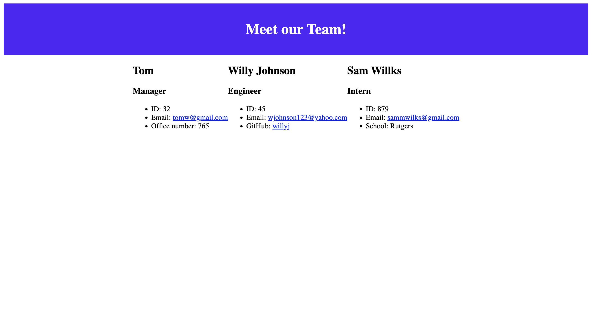

# oop-team-profile-generator

## Description
---
This is a command-line application that generates a html profile page with data from a users input through the prompts in the terminal.

## Usage
---
Running `npm start` begins the terminal prompts where the user choses what kind of employee they would like to add followed by some questions about the employee. When finished, it will generate a profile page for all entered employees.

## Installation
---
To install this project to get the development environment running:

1. Clone GitHub repository here: https://github.com/aHoff6/oop-team-profile-generator
by clicking the green "code" button and copying the URL.

2. Open the Command Line and change the directory to where you would like to clone the directory.

3. Type the command "git clone" followed by the URL you copied earlier and press enter.

4. Run `npm install` to install dependencies.

5. Run `npm start` to begin prompts for team profile page.

## Reference picture
---

[Click here for a demo video](https://drive.google.com/file/d/11LnHoYVsO_hMU8uA1S3J7SNYALS5_lHl/view)

